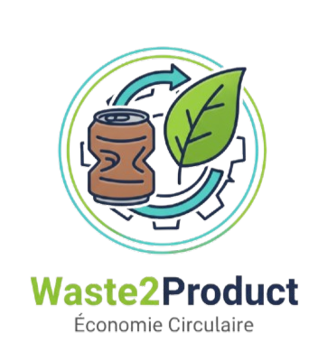

<p align="center">
  
</p>

<h1 align="center">♻️ Waste2Product</h1>

<p align="center">
  <strong>Transformez vos déchets en ressources précieuses</strong>
</p>

<p align="center">
  <a href="#-fonctionnalités">Fonctionnalités</a> •
  <a href="#-technologies">Technologies</a> •
  <a href="#-installation-docker">Installation</a> •
  <a href="#-utilisation">Utilisation</a> •
  <a href="#-devops">DevOps</a>
</p>

<p align="center">
  
  
  
  
  
</p>

---

## 📖 À propos

**Waste2Product** est une plateforme web innovante de gestion et de transformation de déchets en produits valorisables. Notre mission est de créer une économie circulaire en connectant les citoyens, les réparateurs et les artisans pour donner une seconde vie aux objets.

### 🎯 Objectifs

- 🌍 **Réduire les déchets** : Diminuer l'impact environnemental en valorisant les objets
- ♻️ **Économie circulaire** : Transformer les déchets en ressources
- 🤝 **Communauté** : Créer un réseau d'entraide locale
- 💡 **Innovation** : Encourager la créativité et le recyclage

---

## 🚀 Installation Docker (Recommandée)

### Prérequis
- Docker Desktop installé
- Git installé

### Installation en 3 étapes

```bash
# 1. Cloner le projet
git clone https://github.com/YassineEssid/Waste2Product.git
cd Waste2Product

# 2. Copier la configuration
cp .env.example .env

# 3. Démarrer avec Docker
docker-compose up -d --build
```

**C'est tout !** 🎉 L'application sera disponible sur **http://localhost:8080**

### URLs des services

| Service | URL | Identifiants |
|---------|-----|-------------|
| Application | http://localhost:8080 | - |
| SonarQube | http://localhost:9000 | admin/admin |
| Grafana | http://localhost:3000 | admin/admin |
| Prometheus | http://localhost:9090 | - |

📖 **Guide complet** : Voir [QUICKSTART.md](QUICKSTART.md)

---

## ✨ Fonctionnalités

### 👥 Gestion des Utilisateurs
- 🔐 **Authentification sécurisée** (Login/Register)
- 👤 **Profils personnalisés** avec avatar
- 🎭 **4 Rôles** : Utilisateur, Réparateur, Artisan, Administrateur
- 📊 **Dashboards personnalisés** par rôle
- 🔒 **Validation des données** (temps réel + serveur)

### 🗑️ Gestion des Déchets
- ➕ **Ajouter des articles** (déchet/objet)
- 📸 **Upload multiple d'images**
- 📍 **Géolocalisation** (coordonnées GPS)
- 🏷️ **Catégorisation** (électronique, meuble, textile, etc.)
- 🔍 **Recherche & filtres** avancés
- ⭐ **Statut** (disponible, réservé, recyclé)

### 🔧 Demandes de Réparation
- 📝 **Créer des demandes** de réparation
- 👨‍🔧 **Système d'assignation** aux réparateurs
- 📸 **Photos avant/après** réparation
- 💰 **Gestion des coûts** et devis
- 📊 **Suivi du statut** (en attente, accepté, en cours, terminé)

### 🎨 Transformations Artistiques
- ✨ **Créer des transformations** (artisans uniquement)
- 🖼️ **Galerie photos** (avant/processus/après)
- 🏆 **Niveau de difficulté** (facile, moyen, difficile, expert)
- ⏱️ **Temps estimé** de transformation
- 📋 **Liste des matériaux** nécessaires

### 🛒 Marketplace
- 🛍️ **Vendre des créations** issues de transformations
- 💳 **Prix négociables**
- 📦 **Gestion des stocks**
- 🚚 **Méthodes de livraison**
- ⭐ **Articles mis en avant**

### 📅 Événements Communautaires
- 🎉 **Créer des événements** (ateliers, collectes, formations)
- 🖼️ **Images d'événements**
- 📍 **Localisation** des événements
- 🕐 **Gestion date/heure** (début/fin)
- 👥 **Inscriptions** des participants
- 🏷️ **Statut** (à venir, en cours, terminé)

### 🔐 Panel Administrateur
- 👨‍💼 **CRUD complet utilisateurs**
- 📊 **Statistiques avancées**
- 🔍 **Recherche & filtres**
- 📥 **Export CSV**
- 🗑️ **Actions groupées**
- 🎨 **Interface moderne** avec sidebar

---

## 🛠️ Technologies

### Backend
- **Laravel** 12.31.1 (PHP 8.3.26)
- **MySQL** (Base de données)
- **Intervention/Image** 3.11.4 (Traitement d'images)
- **Laravel Sanctum** (API Authentication)
- **Laravel Telescope** (Debugging)

### Frontend
- **Bootstrap** 5.3.0
- **Tailwind CSS** 4.0 (via CDN)
- **Font Awesome** 6.0.0 (Icônes)
- **JavaScript Vanilla** (Validation temps réel)

### Outils
- **Composer** 2.8.12
- **NPM** 11.0.0
- **Node.js** 22.12.0
- **Laragon** (Environnement de développement)

---

## 📦 Installation

### Prérequis

- PHP >= 8.2
- Composer
- MySQL
- Node.js & NPM
- Extension PHP : `fileinfo`, `pdo_mysql`, `gd`

### Étapes d'installation

1. **Cloner le repository**
```bash
git clone https://github.com/YassineEssid/Waste2Product.git
cd Waste2Product
```

2. **Installer les dépendances PHP**
```bash
composer install
```

3. **Installer les dépendances Node.js**
```bash
npm install
```

4. **Configurer l'environnement**
```bash
cp .env.example .env
php artisan key:generate
```

5. **Configurer la base de données**

Éditez le fichier `.env` :
```env
DB_CONNECTION=mysql
DB_HOST=127.0.0.1
DB_PORT=3306
DB_DATABASE=waste2product
DB_USERNAME=root
DB_PASSWORD=
```

6. **Créer la base de données**
```bash
mysql -u root -p
CREATE DATABASE waste2product;
EXIT;
```

7. **Exécuter les migrations**
```bash
php artisan migrate
```

8. **Créer le lien symbolique pour le storage**
```bash
php artisan storage:link
```

9. **Seed la base de données (optionnel)**
```bash
php artisan db:seed --class=TestUsersSeeder
```

10. **Lancer le serveur**
```bash
php artisan serve
```

L'application sera accessible sur : **http://127.0.0.1:8000**

---

## 👤 Comptes de Test

Après avoir exécuté le seeder, vous pouvez vous connecter avec :

| Rôle | Email | Mot de passe |
|------|-------|--------------|
| **Admin** | admin@waste2product.com | password |
| **Utilisateur** | user@test.com | password |
| **Réparateur** | repairer@test.com | password |
| **Artisan** | artisan@test.com | password |

---

## 🎨 Utilisation

### Pour les Utilisateurs

1. **S'inscrire** sur la plateforme
2. **Ajouter des articles** (déchets/objets) avec photos
3. **Créer des demandes de réparation**
4. **Participer aux événements** communautaires
5. **Acheter** sur la marketplace

### Pour les Réparateurs

1. **Consulter les demandes** de réparation
2. **Accepter des missions**
3. **Effectuer les réparations**
4. **Télécharger les photos** avant/après
5. **Gérer ses revenus**

### Pour les Artisans

1. **Trouver des matériaux** à transformer
2. **Créer des transformations** avec galerie photos
3. **Publier sur la marketplace**
4. **Vendre ses créations**
5. **Suivre ses statistiques**

### Pour les Administrateurs

1. **Gérer les utilisateurs** (CRUD complet)
2. **Consulter les statistiques**
3. **Modérer le contenu**
4. **Exporter des données**

---

## 📁 Structure du Projet

```
Waste2Product/
├── app/
│   ├── Http/
│   │   ├── Controllers/
│   │   │   ├── Admin/
│   │   │   │   ├── AdminController.php
│   │   │   │   ├── AdminProfileController.php
│   │   │   │   ├── StatisticsController.php
│   │   │   │   └── UserController.php
│   │   │   ├── Auth/
│   │   │   │   └── AuthController.php
│   │   │   ├── CommunityEventController.php
│   │   │   ├── DashboardController.php
│   │   │   ├── MarketplaceItemController.php
│   │   │   ├── ProfileController.php
│   │   │   ├── RepairRequestController.php
│   │   │   ├── TransformationController.php
│   │   │   └── WasteItemController.php
│   │   ├── Middleware/
│   │   │   └── RoleMiddleware.php
│   │   └── Requests/
│   │       ├── LoginRequest.php
│   │       ├── RegisterRequest.php
│   │       ├── StoreUserRequest.php
│   │       ├── UpdatePasswordRequest.php
│   │       ├── UpdateProfileRequest.php
│   │       └── UpdateUserRequest.php
│   └── Models/
│       ├── CommunityEvent.php
│       ├── EventRegistration.php
│       ├── MarketplaceItem.php
│       ├── RepairRequest.php
│       ├── Transformation.php
│       ├── User.php
│       └── WasteItem.php
├── database/
│   ├── migrations/
│   └── seeders/
│       ├── DatabaseSeeder.php
│       └── TestUsersSeeder.php
├── resources/
│   └── views/
│       ├── admin/
│       ├── auth/
│       ├── dashboards/
│       ├── events/
│       ├── layouts/
│       ├── marketplace/
│       ├── profile/
│       └── waste-items/
├── routes/
│   ├── api.php
│   ├── console.php
│   └── web.php
└── public/
    ├── css/
    └── images/
        └── waste2product_logo.png
```

---

## 🔒 Sécurité

- ✅ **Validation des données** (Form Requests)
- ✅ **Protection CSRF** (Laravel)
- ✅ **Hash des mots de passe** (bcrypt)
- ✅ **Validation des emails** (RFC + DNS)
- ✅ **Upload sécurisé** (type, taille, dimensions)
- ✅ **Middleware d'authentification**
- ✅ **Protection par rôles** (RoleMiddleware)
- ✅ **Vérification des mots de passe** (pwned passwords)

---

## 📸 Captures d'écran

### Page d'Accueil


### Gestion des Utilisateurs (Admin)


### Marketplace


### Événements Communautaires


---

## 🧪 DevOps & CI/CD

### Tests Automatisés

Le projet utilise **GitHub Actions** pour l'intégration continue :

- ✅ **Tests automatiques** à chaque push/PR
- ✅ **Analyse de qualité** avec SonarCloud
- ✅ **Couverture de code** avec Codecov
- ✅ **Analyse statique** (PHPStan, PHP_CodeSniffer)

### Workflow CI/CD

```yaml
Push/PR → Tests Unitaires → SonarCloud → Quality Gate → ✅ Merge
```

### Services DevOps (Docker)

| Service | URL | Utilité |
|---------|-----|---------|
| **SonarQube** | http://localhost:9000 | Analyse qualité du code |
| **Prometheus** | http://localhost:9090 | Monitoring métriques |
| **Grafana** | http://localhost:3000 | Dashboards visuels |

### Commandes utiles

```bash
# Lancer les tests
docker-compose exec app vendor/bin/phpunit

# Voir les logs
docker-compose logs -f app

# Redémarrer les services
docker-compose restart
```

---

## 🚀 Fonctionnalités à venir

- [ ] 💬 **Système de messagerie** entre utilisateurs
- [ ] ⭐ **Système de notation** et avis
- [ ] 📧 **Notifications par email**
- [ ] 📱 **Application mobile** (Flutter)
- [ ] 🌍 **Multilingue** (FR/EN/AR)
- [ ] 📊 **Rapports PDF**
- [ ] 🔔 **Notifications temps réel** (Pusher)
- [ ] 🗺️ **Carte interactive** des articles/événements

---

## 🤝 Contribution

Les contributions sont les bienvenues ! Voici comment participer :

1. **Fork** le projet
2. **Créer** une branche (`git checkout -b feature/AmazingFeature`)
3. **Commit** vos changements (`git commit -m 'Add AmazingFeature'`)
4. **Push** vers la branche (`git push origin feature/AmazingFeature`)
5. **Ouvrir** une Pull Request

---

## 📝 License

Ce projet est sous licence **MIT**. Voir le fichier [LICENSE](LICENSE) pour plus de détails.

---

## 👨‍💻 Contributeurs

<table>
  <tr>
    <td align="center">
      <a href="https://github.com/YassineEssid">
        
        <br />
        <sub><b>Yassine Essid</b></sub>
      </a>
      <br />
      <sub>Project Owner</sub>
    </td>
    <td align="center">
      <a href="https://github.com/GHAITH">
        
        <br />
        <sub><b>Ghaith</b></sub>
      </a>
      <br />
      <sub>Developer</sub>
    </td>
  </tr>
</table>

---

## 📞 Contact

- **Email** : contact@waste2product.com
- **GitHub** : [YassineEssid/Waste2Product](https://github.com/YassineEssid/Waste2Product)

---

## 🙏 Remerciements

- [Laravel](https://laravel.com) - Framework PHP
- [Bootstrap](https://getbootstrap.com) - Framework CSS
- [Font Awesome](https://fontawesome.com) - Icônes
- [Intervention/Image](http://image.intervention.io) - Traitement d'images
- Tous les contributeurs qui ont participé à ce projet

---

<p align="center">
  Fait avec ❤️ pour un monde plus durable
</p>

<p align="center">
  ♻️ <strong>Waste2Product</strong> - Transformez vos déchets en opportunités ♻️
</p>

